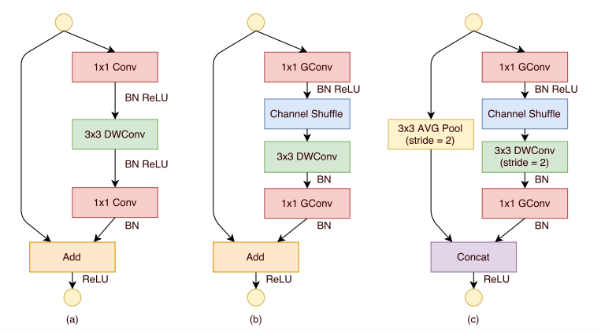

# ShuffleNetV1
> [ShuffleNet: An Extremely Efficient Convolutional Neural Network for Mobile Devices](https://arxiv.org/pdf/1707.01083.pdf)

## Introduction
***

ShuffleNet is a computationally efficient CNN model proposed by KuangShi Technology in 2017, which, like MobileNet and SqueezeNet, etc., is mainly intended to be applied in mobile. Therefore, the design goal of ShuffleNet is also how to use limited computational resources to achieve the best model accuracy, which requires a good balance between speed and accuracy.ShuffleNet uses two operations at its core: pointwise group convolution and channel shuffle, which greatly reduces the model computation while maintaining accuracy. This greatly reduces the computational effort of the model while maintaining accuracy. The main design ideas of CNN models for mobile are mainly two: model structure design and model compression, ShuffleNet and MobileNet belong to the former, both of which design more efficient network structures to achieve smaller and faster models, instead of compressing or migrating a large trained model.



## Results
***

| Model                 | Context      | Top-1 (%) | Top-5 (%) | Params (M) | Train T.   | Infer T. | Download  | Config  | Log     |
| --------------------- | ------------ | --------- | --------- | ---------- | ---------- | -------- | --------- | ------- | ------- |
| shufflenet_v1_g3_x0_5 | D910x8-G57.0 | 57.05     | 79.73     | 0.73       | 169s/epoch |          | [model]() | [cfg]() | [log]() |
| shufflenet_v1_g3_x1_0 | D910x8-G     | 67.77     | 87.73     | 1.89       | 192s/epoch |          | [model]() | [cfg]() | [log]() |
| shufflenet_v1_g3_x1_5 | D910x8-G     | 71.53     | 90.17     | 3.48       | 303s/epoch |          | [model]() | [cfg]() | [log]() |
| shufflenet_v1_g3_x2_0 | D910x8-G     | 74.02     | 91.74     | 5.50       | 232s/epoch |          | [model]() | [cfg]() | [log]() |

#### Notes

- All models are trained on ImageNet-1K training set and the top-1 accuracy is reported on the validatoin set.
- Context: GPU_TYPE x pieces - G/F, G - graph mode, F - pynative mode with ms function.  

## Quick Start
***
### Preparation

#### Installation
Please refer to the [installation instruction](https://github.com/mindspore-ecosystem/mindcv#installation) in MindCV.

#### Dataset Preparation
Please download the [ImageNet-1K](https://www.image-net.org/download.php) dataset for model training and validation.

### Training

- **Hyper-parameters.** The hyper-parameter configurations for producing the reported results are stored in the yaml files in `mindcv/configs/shufflenetv1` folder. For example, to train with one of these configurations, you can run:

  ```shell
  # train shufflenet_v1_g3_x2_0 on Ascend
  cd mindcv/scripts
  bash run_distribute_train_ascend.sh ./hccl_8p_01234567_123.60.231.9.json /tmp/dataset/imagenet ../configs/shufflenet_v1/shufflenet_v1_2.0_ascend.yaml
  ```

  Note that the number of GPUs/Ascends and batch size will influence the training results. To reproduce the training result at most, it is recommended to use the **same number of GPUs/Ascneds** with the same batch size.

Detailed adjustable parameters and their default value can be seen in [config.py](../../config.py).

### Validation

- To validate the model, you can use `validate.py`. Here is an example for shufflenet_v1_g3_x2_0 to verify the accuracy of your training.

  ```shell
  python validate.py -c configs/shufflenet_v1/shufflenet_v1_2.0_ascend.yaml
  ```

### Deployment (optional)

Please refer to the deployment tutorial in MindCV.


